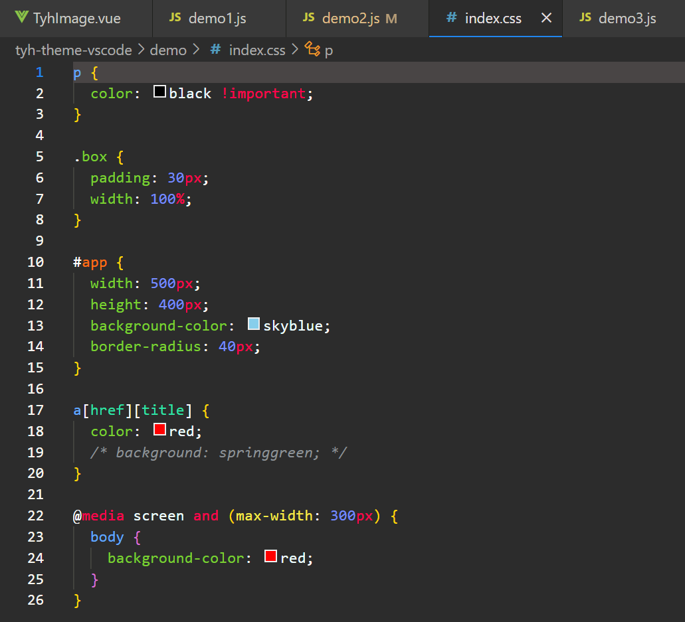

  

   English | Chinese

# tyh-theme

tyh-theme is a comfortable vscode theme plug-in independently developed by tyh2001, with built-in dark and light themes.

For developers, having a comfortable theme and code color may make you feel very comfortable, and solving bugs won't seem so upset. I hope the theme of tyh theme can let you write better code.

# dark-theme

# light-theme

# Installation

1. install [Visual Studio Code](https://code.visualstudio.com)
2. Launch Visual Studio Code
3. Choose **Extensions** from menu
4. Search for **tyh-theme**
5. Click **Install** to install it
6. From the menu bar click: File > Preferences > Color Theme > **tyh-theme**

# About

This is my first attempt to create a vscode theme. If you have any suggestions, <a href="https://github.com/Tyh2001/tyh-theme-vscode/issues">please give me feedback</a>. I also hope you can like **tyh-theme** very much. I also hope it can be liked by more and more people, don't you?

If you want to develop your own vscode theme, you can refer to <a href="https://code.visualstudio.com/api/extension-guides/color-theme">here</a>.

# Contribution

  
  <h4 style="display: inline-block;">tyh2001</h4>

