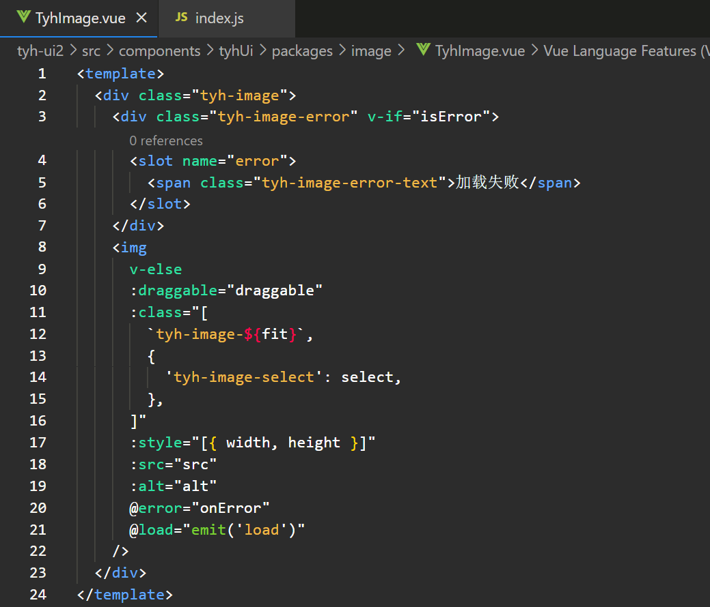
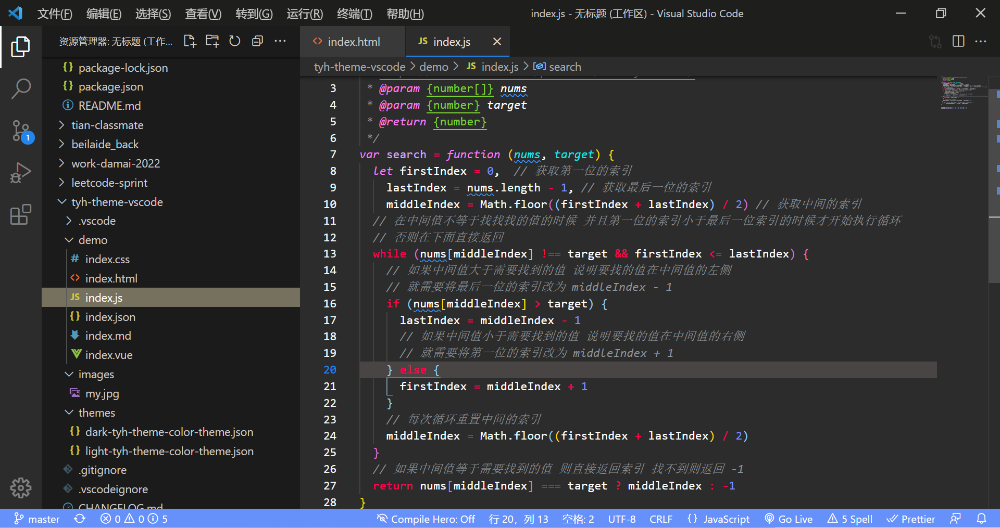
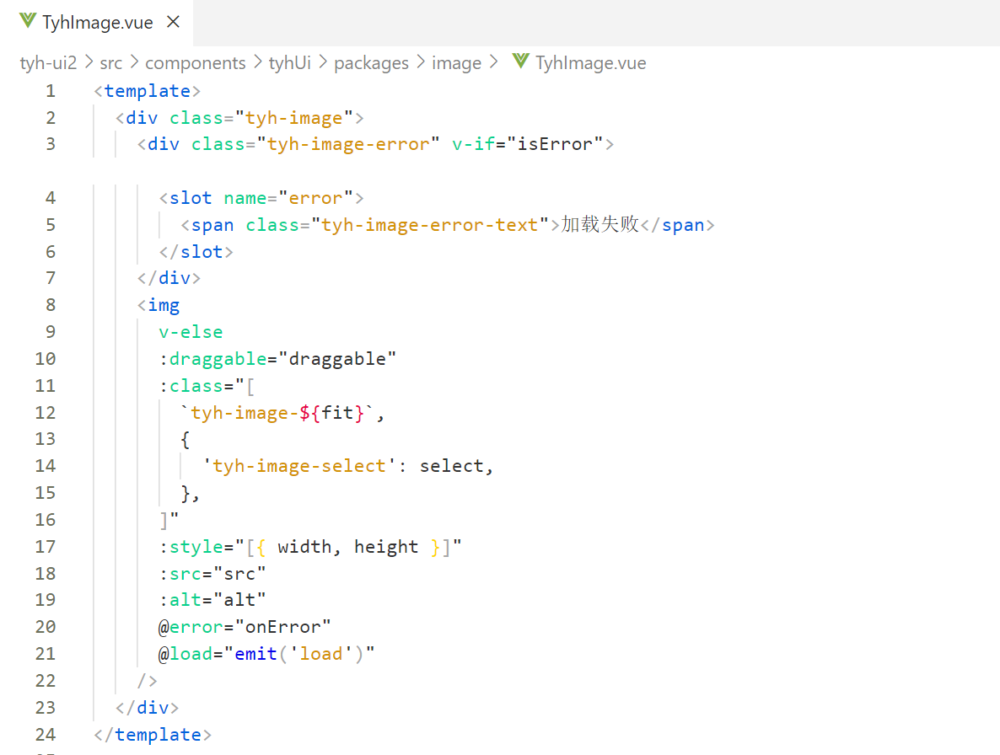
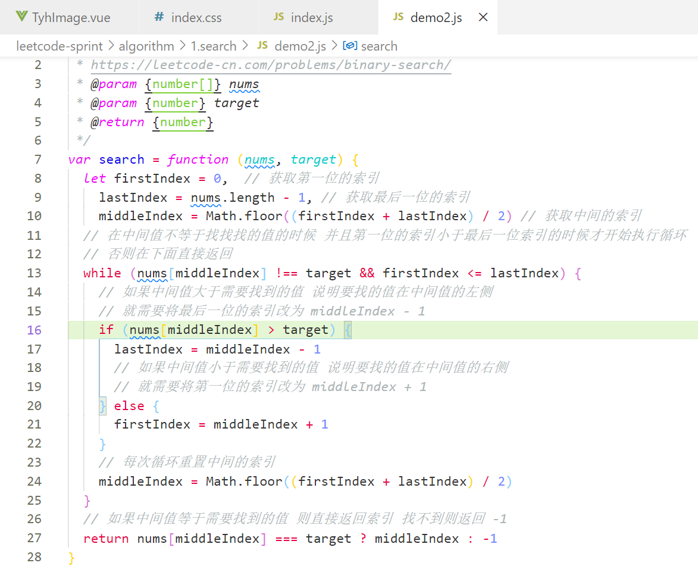

  

   <a href="https://github.com/Tyh2001/tyh-theme-vscode/blob/master/README.md">English</a> | Chinese

# tyh-theme

tyh-theme 是由 <a href="https://github.com/Tyh2001">tyh2001</a> 独立开发的一款可以令人舒适的 vscode 主题插件，内置深色和浅色主题两种提供选择。

对于开发者而言，能有一款舒适的主题和代码颜色，也许会让你的心情也变得十分舒畅，解决 bug 也不会显得那么的烦躁，希望 tyh-theme 这个主题能让你编写出更优秀的代码。

# 黑暗主题

这是我正在使用的黑色主题，我个人比较喜欢黑暗色调

# 明亮主题

因为远眺绿色景物，能够使眼睛得到放松与休息，所以我将浅色主题的侧边栏设计为绿色，希望能使你编写代码时候可以放松一些

# 安装

1. 安装 [Visual Studio Code](https://code.visualstudio.com)
2. 启动 Visual Studio Code
3. 从菜单中选择**扩展**
4. 搜索 **tyh-theme**
5. 单击**安装**进行安装
6. 从菜单栏中单击：文件 > 首选项 > 颜色主题 > **tyh-theme-dark / tyh-theme-light**

# 关于

这是我第一次尝试制作 vscode 主题，有什么建议欢迎大家<a href="https://github.com/Tyh2001/tyh-theme-vscode/issues">给我反馈</a>。我也很希望你们可以很喜欢 tyh-theme，我也希望它可以越来越受到更多人喜欢，不是吗？

如果你也想开发属于自己的 vscode 主题，可以参考<a href="https://code.visualstudio.com/api/extension-guides/color-theme">这里</a>。

# 贡献者

  
  <h4 style="display: inline-block;">tyh2001</h4>

